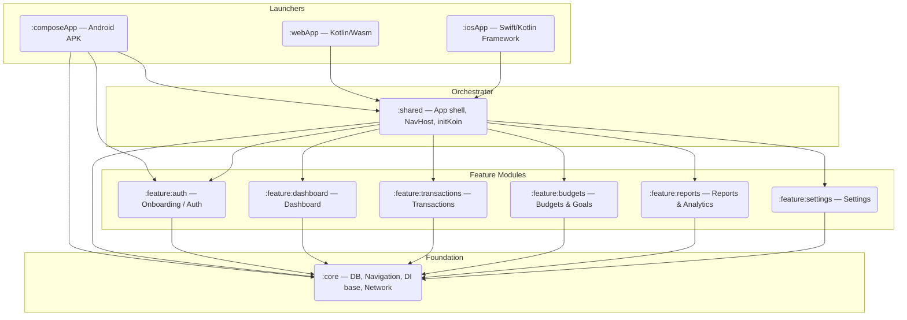

# BudgetMaster — Architecture Documentation

BudgetMaster is a **Compose Multiplatform** personal finance app targeting Android, iOS, and Web
(Kotlin/Wasm). The architecture is built on three non-negotiable pillars:

1. **Feature-First Module Graph** — each product feature is its own Gradle module with its own
   domain, data, and presentation layers fully co-located inside it.
2. **Clean Architecture within every feature** — layers are strictly separated; outer layers depend
   only on inner ones.
3. **MVI (Model-View-Intent)** — all ViewModels follow a single, predictable unidirectional
   data-flow loop.

---

## 1. Module Graph



> **Rule:** No feature module may depend on another feature module. All cross-feature navigation is
> coordinated by `:shared` via the central `NavHost`.

---

## 2. Module Responsibilities

### `:core` — Foundation

The only cross-cutting shared infrastructure. Contains **no business logic and no screens**.

| Package | Contents |
|---|---|
| `core.db` | SQLDelight `BudgetMasterDatabase`, `DatabaseDriverFactory` (expect/actual), `DatabaseProvider` (async-safe lazy init) |
| `core.designsystem` | `AppTheme`, 4 selectable `AppPalette`s (Indigo default, Emerald, Ocean, Sunset), `AppTypography` (tabular figures for amounts), `FinancialColors` (palette-independent income/expense/chart colors), `Spacing`, `Motion`, `DarkModeSetting` |
| `core.localization` | `AppLanguage` (System/English/French), `LocalAppLocale` (expect/actual in-app locale override) |
| `core.prefs` | `KeyValueStore` (expect impls: DataStore on Android/iOS, `localStorage` on Wasm), `AppSettingsRepository` (palette / dark mode / language) |
| `core.di` | `coreModule` + `platformCoreModule` — registers DB, `KeyValueStore`, `AppSettingsRepository` |
| `core.model` | Shared primitive domain models reused by multiple features |
| `core.navigation` | `AuthRoute` — sealed type-safe route hierarchy shared by all feature nav graphs |

String resources (`values/strings.xml`, `values-fr/strings.xml`) also live in `:core` —
the single source for all localized text.

**Platform variants** (`androidMain` / `iosMain` / `wasmJsMain`):
- `AndroidSqliteDriver` / `NativeSqliteDriver` / `WebWorkerDriver` (sql.js worker via `@cashapp/sqldelight-sqljs-worker`)
- OkHttp / Darwin / built-in HTTP clients
- `AppContextHolder` — static Android `Context` reference for driver init

**Dependencies:** Kotlin std, Coroutines, SQLDelight runtime, Ktor core, DataStore,
Compose runtime/ui/foundation/material3 (for the design system — still no screens).

---

### `:feature:auth` — Authentication & Onboarding Feature

Self-contained feature module. The cleanest example of the Feature-First approach: every layer
lives here.

```
feature/auth/
└── commonMain/
    └── com.budgetmaster.auth/
        ├── di/
        │   ├── AuthModule.kt          ← val authModule (use cases + ViewModels)
        │   └── platformAuthModule     ← expect (Firebase/actual per platform)
        ├── domain/
        │   ├── model/                 ← User, AuthStatus
        │   ├── repository/            ← AuthRepository (interface)
        │   └── usecase/               ← SignInUseCase, SignUpUseCase, SignOutUseCase,
        │                                 ResetPasswordUseCase, GetCurrentUserUseCase,
        │                                 LoginUseCase, CheckAuthStatusUseCase,
        │                                 CheckFirstLaunchUseCase, CheckBiometricSupportUseCase,
        │                                 ToggleBiometricUseCase
        ├── presentation/
        │   ├── splash/                ← SplashScreen + SplashViewModel
        │   ├── onboarding/            ← OnboardingScreen + OnboardingViewModel
        │   ├── login/                 ← LoginScreen + LoginViewModel
        │   ├── register/              ← RegisterScreen + RegisterViewModel
        │   ├── forgotpassword/        ← ForgotPasswordScreen + ForgotPasswordViewModel
        │   └── biometric/             ← BiometricScreen + BiometricViewModel
        └── util/
            └── BiometricAuthenticator ← expect/actual (commonMain stub)
```

**Platform variants:**
- `androidMain`: Firebase Android SDK, `androidx.biometric`, `ActivityProvider` (holds Activity ref
  for biometric prompt)
- `iosMain`: Firebase iOS SDK

---

### `:feature:dashboard` — Dashboard Feature

```
feature/dashboard/
└── commonMain/
    └── com.budgetmaster.dashboard/
        ├── di/         ← dashboardModule
        └── presentation/
            └── DashboardScreen + DashboardViewModel
```

---

### `:feature:transactions` — Transactions Feature

```
feature/transactions/
└── commonMain/
    └── com.budgetmaster.transactions/
        ├── di/         ← transactionsModule
        └── presentation/
            └── TransactionsScreen + TransactionsViewModel
```

---

### `:feature:budgets` — Budgets & Goals Feature

The most complete feature module — contains all three clean architecture layers.

```
feature/budgets/
└── commonMain/
    └── com.budgetmaster.budgets/
        ├── data/
        │   └── repository/    ← BudgetRepository implementation
        ├── di/                ← budgetsModule
        ├── domain/
        │   └── repository/    ← BudgetRepository interface
        └── presentation/
            ├── BudgetsScreen + BudgetsViewModel
            └── GoalsScreen + GoalsViewModel
```

---

### `:feature:reports` — Reports & Analytics Feature

```
feature/reports/
└── commonMain/
    └── com.budgetmaster.reports/
        ├── di/         ← reportsModule
        └── presentation/
            └── ReportsScreen + ReportsViewModel
```

---

### `:feature:settings` — Settings Feature

```
feature/settings/
└── commonMain/
    └── com.budgetmaster.settings/
        ├── di/         ← settingsModule
        └── presentation/
            └── SettingsScreen + SettingsViewModel
```

---

### `:shared` — App Orchestrator (Not a Feature)

`:shared` is **not** a feature. It is the composition root that assembles features into a
runnable app. It contains no business logic.

| File | Purpose |
|---|---|
| `App.kt` | Root `@Composable`, applies `MaterialTheme`, adaptive layout shell (phone / tablet / desktop) |
| `App.kt` → `MainNavGraph` | Single `NavHost` declaring all routes for all features |
| `di/SharedModule.kt` | `initKoin()` — bootstraps all feature Koin modules |

**Adaptive layouts in `App.kt`:**
| Breakpoint | Navigation Pattern |
|---|---|
| `width < 600dp` (phone) | `Scaffold` + `NavigationBar` |
| `600dp ≤ width < 1240dp` (tablet) | `NavigationRail` in a `Row` |
| `width ≥ 1240dp` (desktop/web) | `PermanentNavigationDrawer` |

---

### `:composeApp` — Android Launcher

Minimal **plain Android application module** (AGP 9 built-in Kotlin — no KMP plugin;
sources live in `src/main`). Contains:

| File | Purpose |
|---|---|
| `BudgetMasterApplication` | Initializes `AppContextHolder`, calls `initKoin { androidContext(…) }` |
| `MainActivity` | `FragmentActivity`, sets `ActivityProvider`, hosts `setContent { App() }` |
| `src/test/DashboardScreenshotTest` | Roborazzi + Robolectric screenshot tests (goldens in `src/test/snapshots`; `recordRoborazziDebug` / `verifyRoborazziDebug`) |

**Dependencies:** `:shared`, `:core`, `:feature:auth` (androidMain sources needed for
`AppContextHolder` and `ActivityProvider`).

> **Build convention (AGP 9):** every KMP library module applies
> `com.android.kotlin.multiplatform.library` and configures Android inside
> `kotlin { android { … } }` (namespace, compileSdk, minSdk, `androidResources`,
> `withHostTest`). Only `:composeApp` uses `com.android.application`.

---

## 3. Dependency Injection (Koin 4.2.2)

All modules self-register their bindings. `initKoin()` in `:shared` wires them all together.

```
initKoin()
  ├── coreModule          ← DB driver, Ktor client, DataStore (from :core)
  ├── platformCoreModule  ← platform-specific core (expect/actual)
  ├── authModule          ← use cases + ViewModels (from :feature:auth)
  ├── platformAuthModule  ← Firebase client, BiometricAuthenticator (expect/actual)
  ├── dashboardModule     ← (from :feature:dashboard)
  ├── transactionsModule  ← (from :feature:transactions)
  ├── budgetsModule       ← (from :feature:budgets)
  ├── reportsModule       ← (from :feature:reports)
  ├── settingsModule      ← (from :feature:settings)
  └── sharedModule        ← (UI-level shared bindings, from :shared)
```

**Scoping conventions:**

| Koin scope | Used for |
|---|---|
| `single { }` | Repository implementations, DB driver, Ktor client |
| `factory { }` | Use cases (stateless) |
| `viewModel { }` | ViewModels (lifecycle-aware) |

---

## 4. MVI Pattern

All ViewModels must follow this contract:

```kotlin
// Intent — sealed class, one per user action
sealed class TransactionIntent {
    data class AddTransaction(val amount: Double, ...) : TransactionIntent()
    data object LoadTransactions : TransactionIntent()
}

// State — immutable snapshot of the UI
data class TransactionState(
    val transactions: List<Transaction> = emptyList(),
    val isLoading: Boolean = false,
    val error: String? = null
)

// Effect — one-shot side effects (navigation, snackbars)
sealed class TransactionEffect {
    data class ShowSnackbar(val message: String) : TransactionEffect()
    data object NavigateBack : TransactionEffect()
}

class TransactionViewModel(...) : ViewModel() {
    private val _state = MutableStateFlow(TransactionState())
    val state: StateFlow<TransactionState> = _state.asStateFlow()

    private val _effect = MutableSharedFlow<TransactionEffect>()
    val effect: SharedFlow<TransactionEffect> = _effect.asSharedFlow()

    fun onIntent(intent: TransactionIntent) { /* ... */ }
}
```

Composables observe `state` via `collectAsStateWithLifecycle()` and dispatch intents. They never
hold business logic.

---

## 5. Persistence (SQLDelight 2.3.2)

SQLDelight is configured in `:core` with `generateAsync = true` to support Kotlin/Wasm.

### Driver factory (expect/actual)

| Platform | Driver |
|---|---|
| Android | `AndroidSqliteDriver` via `.asSynchronousDriver()` |
| iOS | `NativeSqliteDriver` via `.asSynchronousDriver()` |
| WasmJs | `WebWorkerDriver` (runs SQL in a background web worker) |

`DatabaseProvider` lazily initializes the schema using a Coroutines `Mutex` to prevent race
conditions during WasmJs async driver startup.

---

## 6. Feature-First Conventions (Rules)

These rules are **non-negotiable**. Violations must be caught in code review.

| Rule | Rationale |
|---|---|
| Each feature module owns its `domain/`, `data/`, `presentation/`, and `di/` layers internally | Colocation — all feature code lives in one place |
| Feature modules **never** import each other | Prevents spaghetti coupling; `:shared` is the only coordinator |
| `:core` contains **no UI** and **no business logic** | It is infrastructure only |
| Use cases are `factory` scoped (stateless) | Never hold mutable state in a use case |
| All async work in ViewModels uses `viewModelScope` only | Never use `GlobalScope` or `runBlocking` |
| All platform-specific code uses `expect/actual` | Keeps `commonMain` clean and testable |
| All colors from `MaterialTheme.colorScheme` / `MaterialTheme.financialColors` | No hardcoded `Color(…)` outside `core.designsystem` |
| No hardcoded strings — use `StringResources` from `:core` (`values/`, `values-fr/`) | Bilingual EN/FR from day one |
